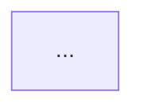

Before starting, read the file `repomix-output.md` in the repository root.
This file contains the full codebase packaged by repomix and is your
primary source for analysis. If the file does not exist, stop and tell
the user to run `repomix --output repomix-output.md --style markdown` first.

Analyse it thoroughly and produce an `ARCHITECTURE.md` file in the repository root.

The goal is a document that a new developer could read in 10 minutes and come away with a genuine mental model of the project — how it works, how it's structured, and how to navigate it confidently. Prioritise clarity and visual communication over exhaustiveness.

Write in plain, direct English. Use diagrams wherever a visual would communicate something faster than prose.

---

## What This Project Does

2–3 paragraph introduction covering:
- What problem this project solves
- Who uses it and in what context
- The core technical approach at a high level

---

## Architecture Overview

A prose description of the top-level structure, followed by a Mermaid diagram showing the main modules and how they relate to each other.



Keep the diagram to the most important relationships — 5 to 10 nodes maximum. Do not try to map every file.

> **Mermaid compatibility note:** Do not use `\n` inside node labels or edge labels — Mermaid does not render it as a line break. Use `<br/>` inside node label strings (e.g. `["line1<br/>line2"]`) for multi-line nodes, and keep edge labels (after `:`) on a single line.

---

## Key Data Flows

For each of the 2–3 most important flows in the system, write a short paragraph explaining it, followed by a Mermaid sequence diagram.

Example structure:

### Flow Name
Brief explanation of what this flow represents and why it matters.

```mermaid
sequenceDiagram
    ...
```

---

## Module Guide

A table giving a developer a quick map of the codebase:

| File / Module | Responsibility | Notes |
|---|---|---|
| `filename.py` | What it owns | Anything worth flagging |

Include a short paragraph after the table highlighting any non-obvious boundaries — e.g. why certain concerns live where they do.

---

## State & Lifecycle

If the application has distinct modes, states, or a meaningful lifecycle, represent it as a Mermaid state diagram:


If the application has no meaningful state machine, omit this section entirely.

---

## Dependencies

A short table of external dependencies:

| Package | Purpose | Why this one |
|---|---|---|
| `package` | What it does | Why it was chosen over alternatives |

---

## Getting Started

Brief practical notes for a new developer:
- How to set up and run the project locally
- Any non-obvious environment requirements
- Where to start reading the code if you want to understand it deeply
