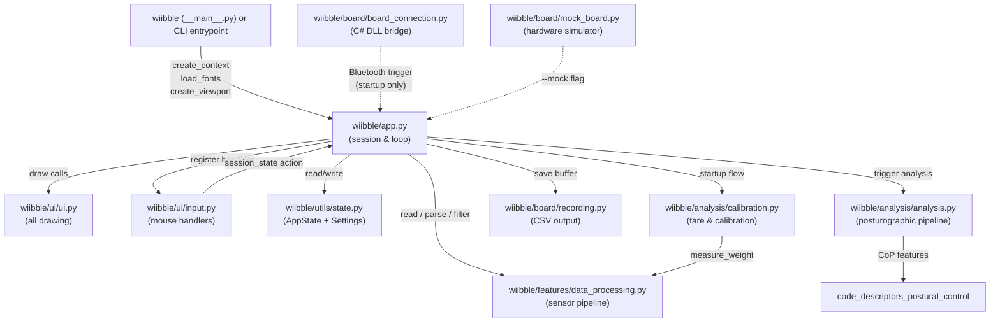
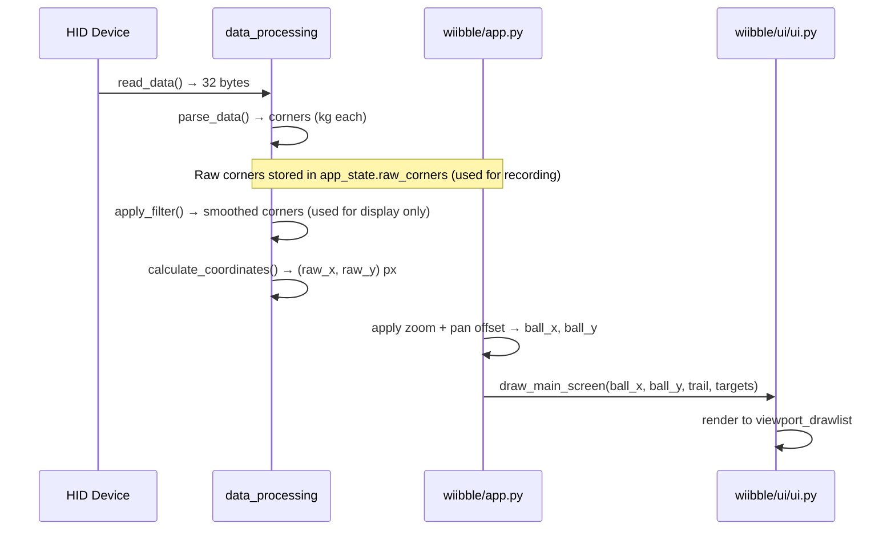
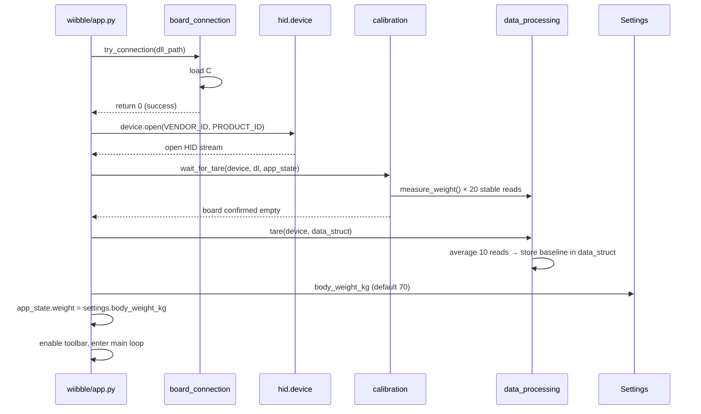
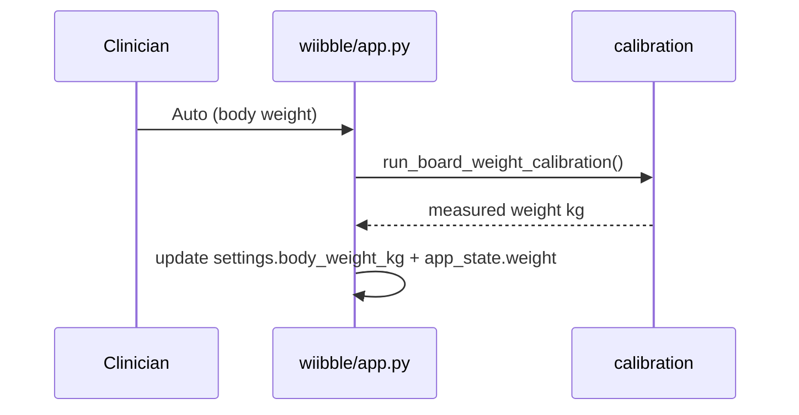
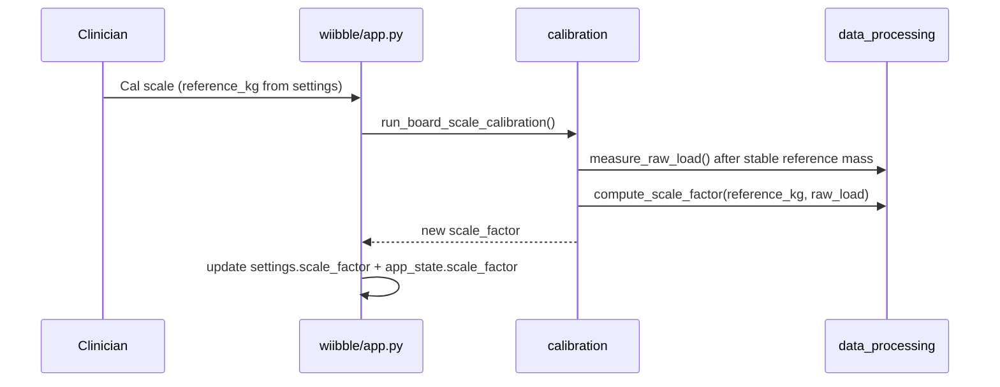
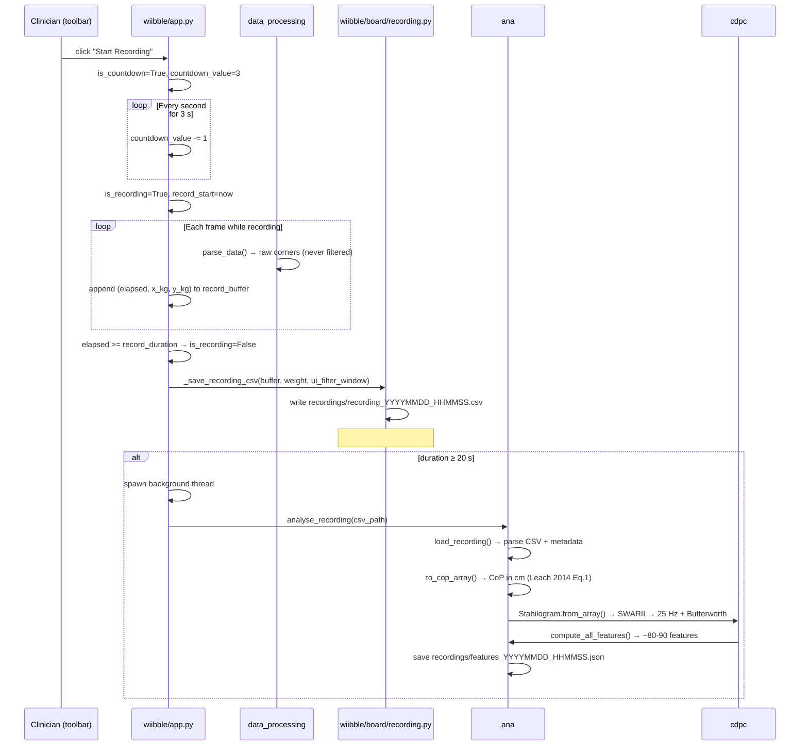
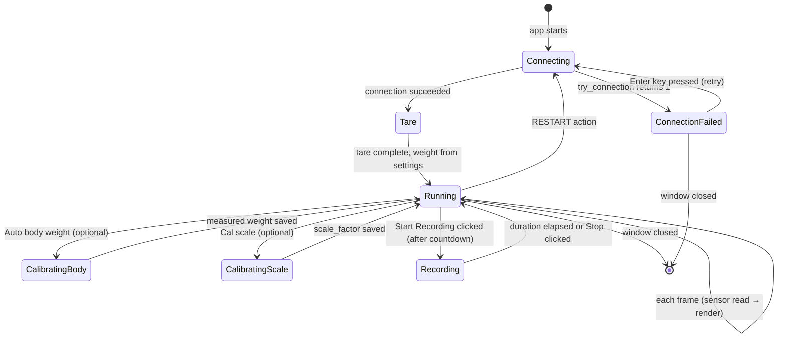

# WIIBBLE — Architecture Overview

## What This Project Does

WIIBBLE repurposes a Nintendo Wii Balance Board as a clinical force platform. Physiotherapists place the board in front of a screen, have the patient stand on it, and watch a live cursor track the patient's centre of pressure in real time. The tool also lets clinicians draw rehabilitation target circles on screen and record sessions to CSV for later analysis. It was built as part of the EPIC-Tech study at The University of Queensland / Griffith University / Princess Alexandra Hospital.

The key technical challenge is bridging a consumer gaming peripheral into a clinical workflow on a standard Windows PC. The board pairs over Bluetooth and exposes raw four-corner weight data as HID reports. WIIBBLE reads those 32-byte packets at ~120 fps, converts them to a screen position, and renders the result using an immediate-mode GPU renderer (DearPyGui) so the display never lags behind the sensor.

An intentional design constraint is that the app must run on computers that cannot have Python installed — clinicians get a single `.exe`. All business logic is in Python; a small C# DLL (`WiiBalanceBoardLibrary`) handles the one-time Bluetooth handshake that Windows requires before HID data flows.

For developer setup, build instructions, and running the app, see [DEV.md](DEV.md).

---

## Architecture Overview

The codebase uses a `src/` layout (`src/wiibble/`) and is divided into six clear layers: entry point, session orchestration, UI rendering, input handling, sensor pipeline, and support utilities.

`wiibble/app.py` is the hub. It owns the session lifecycle and reaches into every other module, but it never draws — that is entirely delegated to `wiibble/ui/ui.py`. Input callbacks in `wiibble/ui/input.py` communicate back to `app.py` only through `session_state["action"]`, keeping the input layer decoupled from session logic. `wiibble/features/data_processing.py` has no DPG or state imports at all — it is a pure functional pipeline that can be tested without any hardware or GUI.

---

## Key Data Flows

### 1. Live sensor → cursor on screen

Every frame, raw bytes from the board are transformed into a pixel position and rendered. This is the heartbeat of the application.

### 2. Session startup (connect → tare → main canvas)

Before any data is shown, the board must be connected and zeroed. Body weight is loaded from persisted settings (default 70 kg). On-board weight calibration is optional and triggered from the settings panel.

On-demand board calibration (settings panel):

On-demand board scale calibration (settings panel):

### 3. Recording a session to CSV

A clinician starts a recording (with optional countdown), the app buffers force-deviation values each frame, and the buffer is flushed to a CSV file when recording stops.

---

## Module Guide

| Module | Responsibility | Notes |
|---|---|---|
| `wiibble/__main__.py` | DPG context, argparse, logging, screen-size detection | Deliberately thin — safe to import in tests; provides WIIBBLE's Python entrypoint |
| `wiibble/app.py` | Session lifecycle, render loop, recording state machine, action dispatch | The largest file; still being refactored (see TODO) |
| `wiibble/ui/ui.py` | Every DPG draw call — canvas, cursor, trail, targets, calibration screens, stats bar, toolbar | Never reads `AppState` directly during draws; receives values as arguments |
| `wiibble/ui/input.py` | Mouse click/drag/release/wheel handlers; target creation; Ctrl+pan; Ctrl+zoom | Communicates back to `app.py` only via `session_state["action"]` |
| `wiibble/features/data_processing.py` | Raw HID read, byte parsing + tare, moving-average filter, coordinate calc, weight measurement | Pure functions — no DPG imports, no state; fully unit-testable |
| `wiibble/analysis/calibration.py` | Tare detection and body-weight calibration blocking loops | Renders its own screens inline; calls `dpg.render_dearpygui_frame()` directly |
| `wiibble/utils/state.py` | `AppState` (runtime mutable state) + `Settings` (persisted preferences) | Settings auto-saved to `~/.wiibble/settings.json`; unknown fields silently ignored on load |
| `wiibble/utils/constants.py` | Hardware IDs, byte offsets, `SCALE_FACTOR_DEFAULT`, thresholds, UI sizes | Factory default scale factor; runtime value lives in settings |
| `wiibble/ui/theme.py` | Colour palette, global DPG theme, font loading (FontAwesome + Roboto 100px) | `load_fonts()` must be called before `dpg.setup_dearpygui()` |
| `wiibble/board/recording.py` | `_save_recording_csv()` — write buffer to timestamped CSV with body-weight + ui_filter_window metadata | Extracted from `app.py` specifically for testability |
| `wiibble/analysis/analysis.py` | End-to-end posturographic pipeline: `load_recording()` → `to_cop_array()` → `Stabilogram` → `compute_all_features()` | Imports `code_descriptors_postural_control`; safe to use standalone. Auto-triggered by `app.py` for recordings ≥ 20 s. |
| `wiibble/board/mock_board.py` | `MockHIDDevice` — drop-in for `hid.device()`, named scenarios | Phase model (tare → step_on_stable → normal); `enter_running_mode()` after startup tare |
| `wiibble/board/board_connection.py` | C# DLL loader via `pythonnet`; `try_connection()` triggers the Bluetooth handshake | Called once at startup then never again — all data flows through `hidapi` |
| `wiibble/utils/resources.py` | `resource_path()` — resolves asset paths in dev and Nuitka standalone builds | Pre-resolves common paths at import time; use this for all asset access |

**Boundary worth noting:** `wiibble/board/board_connection.py` and `hid.device()` look like they do the same thing but serve entirely different purposes. The C# DLL is needed to trigger the OS-level Bluetooth handshake (a Nintendo quirk); once that succeeds and the DLL disconnects, `hidapi` opens the board as a plain HID device for all data. A developer who removes `board_connection.py` because "we're already using hidapi" will break real-hardware connects.

---

## State & Lifecycle

The toolbar and gear button are created at startup but hidden until tare completes and the main canvas is shown.

---

## Dependencies

| Package | Purpose | Why this one | Notes / risks |
|---|---|---|---|
| `dearpygui==2.1.1` | Immediate-mode GPU GUI | Redraws full canvas every frame — the natural model for real-time sensor data. `viewport_drawlist` gives true full-screen drawing. | **Pin strictly** — API breaks between minor versions. See [ADR-0001](decisions/0001-migrate-to-pyqt6.md) for migration proposal. |
| `hidapi==0.14.0.post2` | Read raw 32-byte HID reports from the board | Only Python library that reads raw HID without a kernel driver. Board exposes itself as a standard HID device after pairing. | |
| `pythonnet==3.0.3` | Load the C# DLL at runtime via `clr.AddReference()` | The Bluetooth handshake logic already existed in C# (WiiBalanceWalker lineage); `pythonnet` bridges it without a rewrite. | Must be 3.x — 2.x API is incompatible. |
| `numpy==1.24.4` | Array averaging in `tare()` | Used in one place only. | **Pinned to last version supporting Python 3.8** — can be relaxed if minimum Python version is raised. |
| `pytz` | Timezone-aware timestamps in filenames | Standard choice. | |
| `nuitka>=2.0` *(dev)* | Compile to standalone `.exe` | Produces a true compiled binary — fewer AV false-positives, faster startup, no Python runtime required on clinical machines. | |
| `pytest` / `pytest-cov` *(dev)* | Test runner + coverage | Standard. | Coverage gate ≥ 80% enforced in CI. |
| `ruff>=0.4` *(dev)* | Lint and format | Fast; configured in `pyproject.toml`. | Runs in CI. |

---

## Where to Start Reading

1. **`wiibble/utils/state.py`** — understand `AppState` and `Settings` first; almost every module touches them.
2. **`wiibble/features/data_processing.py`** — the pure sensor pipeline; read alongside `wiibble/utils/constants.py`.
3. **`wiibble/app.py / _run_session()`** — the main session flow from connection to render loop.
4. **`wiibble/ui/ui.py / draw_main_screen()`** — how the canvas is rendered each frame.
