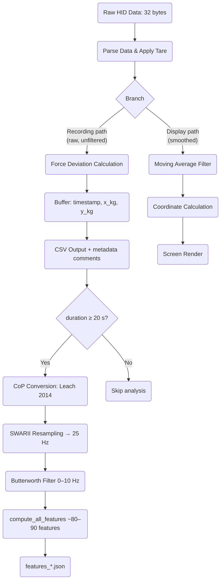

# WIIBBLE Data Processing Pipeline

This document outlines the data processing pipeline for the WIIBBLE application, from raw sensor acquisition through to CSV recording and posturographic feature extraction.

## Pipeline Diagram



```
Raw HID Data (32 bytes)
   ↓
parse_data + tare  →  raw_corners stored in AppState
   │
   ├── RECORDING PATH (raw) ──────────────────────────────────────────────
   │     ↓
   │   calculate_force_deviation_kg (from raw_corners)
   │     ↓
   │   Buffer (timestamp, x_kg, y_kg)
   │     ↓
   │   _save_recording_csv  →  recordings/recording_YYYYMMDD_HHMMSS.csv
   │     (metadata: # total_weight_kg, # ui_filter_window)
   │     ↓
   │   [if duration ≥ 20 s]
   │     ↓
   │   analyse_recording()  (background daemon thread)
   │     ↓
   │   to_cop_array()  →  CoP in cm (Leach et al. 2014 Eq. 1)
   │     ↓
   │   Stabilogram.from_array()  →  SWARII → 25 Hz, Butterworth 0–10 Hz order 4
   │     ↓
   │   compute_all_features()  →  ~80–90 features
   │     ↓
   │   recordings/features_YYYYMMDD_HHMMSS.json
   │
   └── DISPLAY PATH (smoothed) ────────────────────────────────────────────
         ↓
       apply_filter (moving average, window = ui_filter_window)
         ↓
       calculate_coordinates()  →  screen pixels
         ↓
       draw_main_screen()
```


## 1. Data Acquisition
- **Source:** Wii Balance Board (or mock device)
- **Function:** `read_data(device)`
- **Description:** Reads a 32-byte HID report from the device each frame.
- **Output:** Raw byte array (list of 32 integers)

---

## 2. Parsing & Tare Correction
- **Function:** `parse_data(data, data_struct)`
- **Description:**
  - Extracts sensor values for each corner from the raw byte array.
  - Applies tare (baseline) correction using values in `data_struct`.
  - Formula: `(data[i] + data[i+1] / 255 - tare) * SCALE_FACTOR`
- **Output:** Dictionary of corner weights in kg: `{top_left, top_right, bottom_left, bottom_right}`

---

## 3. Branching: Recording vs Display

After parsing, the pipeline splits into two independent paths. **Raw (unfiltered) corner values are stored in `AppState.raw_corners` and used exclusively for recording.** The moving-average filter only affects the display cursor.

---

### 3a. Recording Path — Force Deviation (Raw)
- **Function:** `calculate_force_deviation_kg(top_left, top_right, bottom_left, bottom_right)`
- **Description:**
  - Called using `app_state.raw_corners` (never the smoothed values).
  - Computes net left-right (x) and front-back (y) force deviations in kg.
  - x = (top_right + bottom_right) - (top_left + bottom_left)
  - y = (top_left + top_right) - (bottom_left + bottom_right)
- **Output:** Tuple `(x_kg, y_kg)` — raw, unfiltered

---

### 3b. Display Path — Moving Average Filter
- **Function:** `apply_filter(corners, filter_buffer, filter_window)`
- **Description:**
  - Implements a moving average filter over the last N frames (`ui_filter_window`).
  - Applied **only** to the smoothed values used for cursor rendering.
  - Has no effect on recorded data.
- **Output:** Smoothed corner weights in kg (display only)

---

## 4. Coordinate Calculation (for UI)
- **Function:** `calculate_coordinates(...)`
- **Description:**
  - Converts **smoothed** (filtered) corner weights to screen coordinates.
  - Normalises by total weight, scales to screen size and zoom.
- **Output:** Tuple `(x, y)` in screen pixels

---

## 5. Buffering for Recording
- **Location:** `_update_recording_frame()` in `app.py`
- **Description:**
  - Each frame during recording, appends `(timestamp, x_kg, y_kg)` to `app_state.record_buffer` using the **raw** corner values from `app_state.raw_corners`.
  - Timestamp is relative to recording start.
- **Output:** List of tuples for CSV export

---

## 6. CSV Output
- **Function:** `_save_recording_csv(record_buffer, total_weight_kg, ui_filter_window)`
- **Description:**
  - Writes the buffer to a CSV file in `recordings/` after recording ends.
  - Prepends two metadata comment lines before the CSV header:
    - `# total_weight_kg=XX.XXXX` — patient body weight used for CoP conversion
    - `# ui_filter_window=N` — display smoothing level at capture time (provenance only)
  - Each data row: `time (s), x (kg), y (kg)` — always raw, unfiltered values.
  - Returns the absolute path of the written file.

---

## 7. Auto-Analysis (Posturographic Features)
- **Trigger:** `_save_and_analyse()` in `app.py` — runs if recording duration ≥ 20 s
- **Execution:** Background daemon thread (non-blocking)
- **Function:** `analyse_recording(path, total_weight_kg)` in `analysis.py`
- **Steps:**
  1. `load_recording(path)` — reads CSV rows and parses `# key=value` metadata comments
  2. `to_cop_array(data, total_weight_kg)` — converts `(x_kg, y_kg)` to Centre of Pressure in cm using **Leach et al. 2014** (Sensors 14:18244) Eq. 1:
     - `CoP_ML = 21.65 × x_kg / total_weight_kg`
     - `CoP_AP = 11.9  × y_kg / total_weight_kg`
  3. `Stabilogram.from_array(cop_array)` — SWARII resampling to 25 Hz, Butterworth filter 0–10 Hz order 4
  4. `compute_all_features(stabilogram, params)` — ~80–90 posturographic descriptors
  5. Writes `recordings/features_YYYYMMDD_HHMMSS.json` alongside the CSV
- **Output:** JSON file with all features plus provenance keys (`source_file`, `total_weight_kg`, `ui_filter_window`, `n_samples_raw`, `duration_s`)

---

## 8. Sampling Rate
- **Target:** 100 Hz maximum (capped in main loop, but not strictly enforced)
- **Actual:** Depends on system performance and frame rate
- **Post-resampling:** 25 Hz (SWARII uniform grid, applied inside `analysis.py`)

---

## Notes
- The moving-average filter is applied **only** to the display cursor. Recorded data is always raw.
- All real-time processing is done frame by frame. Analysis runs asynchronously after save.
- The pipeline is identical for both real and mock data sources.
