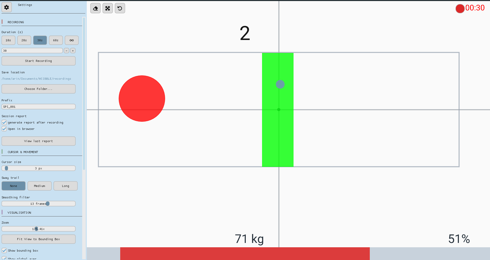

# WIIBBLE User Manual

This manual is written for **clinicians and end users**. For developer setup, analysis pipelines, and report generation, see the [Developer Guide](DEV.md).

---

## Main Interface


*Main screen: settings panel open on the left, live CoP cursor with sway trail on the canvas, weight and balance percentage in the stats bar at the bottom.*

The interface has three areas:

**Settings Panel** — Left side of the screen. Organised into sections: Session, Recording, Cursor & Movement, and Visualisation. Can be collapsed to a floating gear button to maximise canvas space; tap the gear button to reopen it.

**Canvas** — The main area. Shows the live centre-of-pressure cursor, sway trail, targets, and optional bounding box. All mouse interactions happen here.

**Stats Bar** — Bottom of the window. Shows left/right weight distribution percentage and total weight in kg. Colour reflects the amount of weight currently detected on the board.

**Quick Access** — Always-visible buttons on the canvas (after the session starts): **Clear Screen** (eraser icon, top-left next to the gear) and a red **record** button (top-right, same position as the recording indicator). These mirror the settings panel recording control and clear the canvas without opening settings.

---

## Quick Access Buttons

**Clear Screen** (top-left) — Removes all targets and the sway trail from the canvas. Shortcut: **Ctrl+Shift+C**. When the settings panel is open, the clear button moves to the canvas edge beside the panel.

**Record / Stop** (top-right) — Round red button when idle; turns square while recording or during the countdown. The configured duration limit (e.g. `00:10`, or `∞` for indefinite) is shown to the right of the button at all times; elapsed time appears on the left in a larger font while recording. Shortcut: **Ctrl+Space**.

---

## Settings Panel

### Gear Button

Opens and closes the settings panel. When collapsed, a floating gear button remains visible in the top-left corner of the screen, beside the Clear Screen button.

### Calibration

**Body weight (kg)** — Patient reference weight for cursor normalization and CSV recordings. Defaults to 70 kg when not set. Valid range: 1–150 kg.

**Auto** — Runs step-off / step-on calibration to measure body weight on the board. Updates the body weight field when complete.

**Board reference (kg)** — Known mass (10–150 kg) placed on the board for hardware scale calibration. Use a certified weight (e.g. kettlebell, weight plates).

**Cal scale** — Tares the board, prompts you to place the reference mass, then computes and saves the HID raw-to-kg scale factor for this board. The current scale factor is shown below these controls.

### Session

**Restart Session** — Reconnects and re-tares the board. Use when a new patient is assessed or if the board loses connection.

### Recording

**Duration Presets** — Choose from 10 s, 20 s, 30 s, 60 s, or indefinite (∞). The active selection is highlighted.

**Manual Duration** — Type a custom duration in seconds. Enter `0` to record indefinitely until you press Stop.

**Start Recording / Stop Recording** — Starts a 3-second countdown then begins capturing. The button label changes to reflect the current state. Click again to stop early.

**Save Location** — Shows the folder where recordings are saved. Use **Choose Folder…** to change it. The app remembers your choice between sessions.

### Cursor & Movement

**Switch to Avatar / Switch to Circle** — Toggles the cursor between a person icon and a filled circle. You can also click the on-screen cursor directly to toggle.

**Cursor Size** — Adjusts the circle cursor radius. You can also drag the cursor on-screen to resize it.

**Sway Trail** — Controls how much movement history is visible: **None**, **Medium**, or **Long**.

**Smoothing Filter** — Number of frames averaged to smooth the cursor. Lower = more responsive; higher = smoother. This affects display only — recordings always save raw unfiltered data.

### Visualisation

**Zoom** — Adjusts the canvas zoom level. Also controllable with `Ctrl + Mouse Wheel`.

**Fit View to Bounding Box** — Automatically zooms and pans to fit all recorded movement on screen.

**Show Bounding Box** — Toggles the movement extent overlay on the canvas.

**Show Global Axes** — Toggles solid crosshairs at the screen centre (neutral stance reference).

**Show Local Axes** — Toggles dotted crosshairs centred on the sway bounding box, bounded to the box edges.

**Target Jelly Effect** — Animates targets with a wobble when hit.

---

## Mouse & Keyboard Controls

### Mouse

| Action | Effect |
|---|---|
| Left-click cursor | Begin resizing cursor (drag to resize) |
| Left-click canvas (not cursor) | Start placing a new target; drag to set radius |
| Release | Finalise cursor size or new target |
| Right-click a target | Remove that target |
| Ctrl + Left-click drag | Pan the canvas |
| Ctrl + Mouse Wheel | Zoom in/out around the pointer |

### Keyboard

| Key | Context | Effect |
|---|---|---|
| Enter | Connection failed screen | Retry board connection |
| Ctrl+Shift+C | Main session | Clear Screen (remove targets and sway trail) |
| Ctrl+Space | Main session | Start / Stop Recording |

---

## Canvas Elements

**Cursor** — Represents the patient's current centre of pressure. Circle or avatar mode.

**Targets** — Created by left-clicking and dragging. Targets remain fixed to the movement space and scale with zoom. Right-click to remove.

**Sway Trail** — Fading history of recent movement.

**Bounding Box** — Dashed rectangle showing the extent of movement since last clear.

**Global Axes** — Solid grey crosshairs through the screen centre, marking the neutral board-centre reference.

**Local Axes** — Optional dotted crosshairs through the centre of the sway bounding box, spanning only within the box.

**Stats Bar** — Real-time left/right distribution and total weight.

**Recording Indicator** — Countdown and elapsed time during active recording.

---

## Recording Data

Starting a recording triggers a 3-second countdown, then captures data until the set duration elapses or you press Stop. Recordings are saved as CSV files to the selected folder:

**CSV format:**
```
# total_weight_kg=71.2000
# ui_filter_window=5
time (s),x (kg),y (kg)
0.000,0.123,-0.045
...
```

- `time` — elapsed seconds from recording start
- `x (kg)` — left-right force deviation (raw, unfiltered)
- `y (kg)` — front-back force deviation (raw, unfiltered)

The comment lines at the top record the patient body weight and display smoothing level for traceability.

---

## Board Pairing

Pairing the Wii Balance Board to your computer over Bluetooth depends on your Bluetooth adapter type.

### Check your Bluetooth MAC address

Open a Command Prompt and run:
```
getmac /v /fo list
```
Find the Physical Address for your Bluetooth adapter.

### Case 1 — MAC address does NOT contain "00" (permanent pairing)

1. Download [WiiBalanceWalker v0.5](https://github.com/lshachar/WiiBalanceWalker/releases).
2. Open it and click **Add/Remove Bluetooth Wii device**.
3. Copy the **Permanent PIN Code**.
4. In Windows: **Settings → Bluetooth & devices → Add device**.
5. On the board: remove the battery cover and press the red button (blue LED blinks).
6. On the computer: select **Nintendo RVL-WBC-01**, click **Pair**, and paste the Permanent PIN.

This pairing persists — you do not need to repeat it each session.

### Case 2 — MAC address contains "00" (per-session pairing)

Permanent pairing is not supported by this adapter type. Pair each session via:  
**Control Panel → Hardware and Sound → Devices and Printers**

You may need to remove and re-pair if you switch adapters or restart Windows.

---

## Connection & Calibration

On launch the app immediately attempts to connect to the board. If the board is unavailable, an error screen appears with instructions; press **Enter** to retry.

Once connected, the app tares the board (step off until the empty-board screen completes), then opens the main canvas. Body weight comes from **Settings → Calibration** (default 70 kg). You can type a weight manually or use **Auto** to measure it from the board.

**Board scale calibration** (optional, per board): enter a known reference mass under **Board reference (kg)** and click **Cal scale**. This replaces the factory default HID conversion factor and is independent of patient body weight.

The settings panel (gear button) is available as soon as the main canvas appears.

---

## Tips

- Collapse the settings panel to maximise canvas space; the floating gear button re-opens it.
- Use `Ctrl + Mouse Wheel` to zoom into a specific area of the canvas.
- The app saves your preferences between sessions — zoom, save location, trail length, and cursor mode all persist.
- If the cursor feels jittery, increase the **Smoothing Filter** slider.
- If the gear icon is missing, check that `assets/fonts/fa-solid-900.ttf` is present.

---

## Troubleshooting

| Symptom | Solution |
|---|---|
| Board does not connect | Ensure Bluetooth is on, board is paired, and the LED is blinking blue. Check battery level. |
| DLL loading error | Make sure `WiiBalanceBoardLibrary.dll` is built. See [DEV.md](DEV.md). |
| Black screen / no canvas | Restart the app. Update graphics drivers if persistent. |
| Cursor very jittery | Increase the Smoothing Filter slider. |
| Gear icon missing | Check `assets/fonts/fa-solid-900.ttf` is present. |
| Settings lost | Delete `~/.wiibble/settings.json` to reset to defaults. |
| Library error on startup | Run `uv sync` — see [DEV.md](DEV.md). |

For developer and build issues see [DEV.md](DEV.md).

---

## Command-Line Options

```
WIIBBLE.exe [--mock] [--mock-scenario <scenario>]
```

| Flag | Description |
|---|---|
| `--mock` | Run with simulated data — no board required |
| `--mock-scenario <name>` | Choose simulation scenario: `sway` (default), `still`, `lean_left`, `lean_right`, `hands`, `step_on_off`, `calibration` |

These flags work with both `python -m wiibble` (`wiibble`) and the compiled `WIIBBLE.exe`.

---

## Posturographic Analysis & Reports

After recording, sessions can be analysed to extract clinical posturographic features, and an interactive HTML report can be generated for clinical records.

These steps require technical setup and are intended for **administrators or developers**. If you need analysis or reports and do not see them generated automatically, ask your clinic IT administrator or the project technical lead, and point them to the [Developer Guide](DEV.md#posturographic-analysis-and-reporting).
