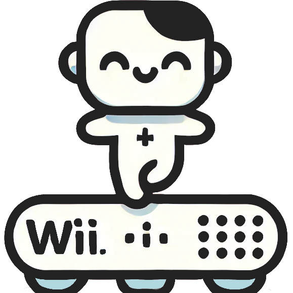

# WIIBBLE - Wii Balance Board Live Environment

<div align="center">
  
</div>

### Overview

WIIBBLE, a tool designed to repurpose the Wii Balance Board for clinical use in rehabilitation settings. WIIBBLE allows clinicians to integrate the balance board into their practice, providing an additional resource for patient rehabilitation.

This project integrates the Wii Balance Board with custom software to measure weight and balance data. It aims to provide a live visualization of weight distribution and balance.

- [WIIBBLE - Wii Balance Board Live Environment](#wiibble---wii-balance-board-live-environment)
    - [Overview](#overview)
  - [💡 Features](#-features)
  - [📝 Prerequisites](#-prerequisites)
    - [⚙️ Requirements for running from source and/or compiling](#️-requirements-for-running-from-source-andor-compiling)
  - [🚀 Getting Started](#-getting-started)
  - [🔧 Board pairing](#-board-pairing)
    - [😀 Case 1: Bluetooth mac address does not contain "00"](#-case-1-bluetooth-mac-address-does-not-contain-00)
    - [😭 Case 2: Bluetooth mac address contains "00"](#-case-2-bluetooth-mac-address-contains-00)
  - [🔨 Installation from Source](#-installation-from-source)
    - [💻 Compiling to an executable](#-compiling-to-an-executable)
  - [📄 Usage](#-usage)
  - [🚑 Troubleshooting](#-troubleshooting)
  - [🙏 Acknowledgements:](#-acknowledgements)

## 💡 Features
<a name="features"></a>
- Simple Real-time data visualization of weight distribution
- Sensitivity calibration 
- Tare functionality for more accurate measurements
- Easy setup for connecting to the Wii Balance Board via Bluetooth *(after pairing: see [Board Pairing](#board-pairing))*

## 📝 Prerequisites
<a name="prerequisites"></a>
- Wii Balance Board
- Windows 10/11
- Bluetooth-enabled computer
- 
### ⚙️ Requirements for running from source and/or compiling
- Python 3.8+
- .NET 8.0
- .NET Framework 4.8

## 🚀 Getting Started
<a name="getting-started"></a>
1. **Download the latest release** from [here](https://github.com/NeuroRehack/WIIBBLE/releases)
     - or clone the repository and follow the instructions at [Installation from Source](#installation-from-source).
2. **Pair the Wii Balance Board with your computer** (see [Board Pairing](#board-pairing)).
3. **Head to the [Usage](#usage) section for instructions on running the application.**

## 🔧 Board pairing
<a name="board-pairing"></a>
Pairing the board to the computer can be a little tricky. The board can be permanently paired to the computer using a pin that is generated from your computer's Bluetooth MAC address. However, this cannot be done if the Bluetooth MAC address has "00" in it. If you have this issue, there may be ways to change your Bluetooth MAC address, but on some hardware, this is not possible or very difficult.

To find out if your Bluetooth MAC address has "00" in it, open a command prompt and type `getmac /v /fo list`. Look for the Physical Address of your Bluetooth adapter. If it has "00" in it, your board will not be able to be permanently paired.

### 😀 Case 1: Bluetooth mac address does not contain "00"
<a name="case1"></a>
To permanently pair the board to your computer, you will need to follow these steps:
  - Download WiiBalanceWalker v0.5 from [here](https://github.com/lshachar/WiiBalanceWalker/releases). 
  - Open the program and click on `Add\Remove Bluetooth Wii device`.
  - Copy the Permanent PIN Code
  - Open Windows settings and go to `Bluetooth & devices` -> `Add device`
  - On the board, remove the battery cover and press the red button. The blue light should start blinking.
  - On the computer, select `Nintendo RVL-WBC-01` and click on `Pair`.
  - Paste the Permanent PIN Code when prompted and click on `Next`.

The board should now be permanently paired with the computer.

### 😭 Case 2: Bluetooth mac address contains "00"
<a name="case2"></a>
You can still pair the board to your computer, but you will have to do it from "`Control Panel\Hardware and Sound\Devices and Printers`" (Windows settings do not allow you to skip the pin). That is annoying on its own, but the board will also need to be removed and paired again every time you switch the Bluetooth adapter or the computer off and on.

## 🔨 Installation from Source
<a name="installation"></a>
1. **Clone the repository, navigate to the directory, and install the required packages:**
   ```bash
   pip install -r requirements.txt
   ```
   You may need to install each dependency one at a time. I have noticed some compatibility issues with the `pygame` and `pygame_gui` packages.

2. **Build the C# library:**
   
      Navigate to the `WiiBalanceBoardLibrary` directory and build the C# library using the following commands:
   
      ```bash
      cd WiiBalanceBoardLibrary
      dotnet build
      ```
### 💻 Compiling to an executable
<a name="compiling"></a>
To compile the python script, you can run the `compiler.bat` file. This will create a folder called `outputBuild` with the executable inside.

## 📄 Usage
<a name="usage"></a>
1. **Connect the Wii Balance Board:**

   Ensure that the Wii Balance Board is paired (see [Board Pairing](#board-pairing)) with your computer via Bluetooth.
2. **Press the button on the Wii Balance Board:**

   The blue LED should be blinking.

3. **Run the application:**

   If running from source: 
   
   -  Start the Python application by running the `main.py` script

   If running the executable:

   - Run the executable from the `outputBuild` folder or the location where you downloaded the executable to.

3. **Application Flow:**

   - The application will attempt to connect to the Wii Balance Board.
   - After connecting, follow the on-screen instructions for sensitivity calibration and tare functions.
   - Once calibrated, the live environment will display real-time weight distribution.

## 🚑 Troubleshooting
<a name="troubleshooting"></a>
- **Library Issues:** If the application fails to run due to library issues, try installing the required packages one at a time.

- **Connection Issues:** If the application fails to connect to the Wii Balance Board, ensure that:
  - Bluetooth is enabled on your computer.
  - The board is correctly paired and the LED is blinking blue.
  - The battery level is sufficient.
  
- **DLL Loading Issues:** Ensure that the `WiiBalanceBoardLibrary.dll` file is built and located in the correct path as specified in `board_connection.py`.

## 🙏 Acknowledgements:
<a name="acknowledgements"></a>
- [WiiBalanceWalker](https://github.com/lshachar/WiiBalanceWalker) for the Wii Balance Board connection library.

