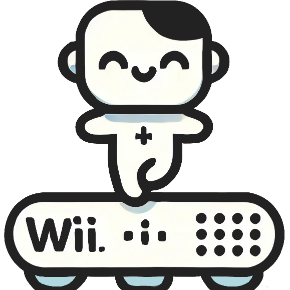

> ⚠️ **Note**: Only Python 3.11 or 3.12 are supported. Python 3.13 and 3.14 are NOT supported due to pythonnet incompatibility. Download 3.12.x from [python.org](https://www.python.org/downloads/).

# WIIBBLE — Wii Balance Board Live Environment

<div align="center">
  
</div>

---

WIIBBLE repurposes the Nintendo Wii Balance Board as a clinical force platform. Physiotherapists place the board in front of a screen, have the patient stand on it, and see a live cursor track their centre of pressure in real time. Sessions are recorded to CSV, and a posturographic analysis pipeline extracts ~80–90 clinical features per session.

Built as part of the **EPIC-Tech study** at The University of Queensland / Griffith University / Princess Alexandra Hospital.

---

<div align="center">
  
  <br><em>Main screen: collapsible settings panel (left), real-time CoP cursor with sway trail (canvas), weight and balance stats (bottom bar).</em>
</div>

---

## Table of Contents

- [WIIBBLE — Wii Balance Board Live Environment](#wiibble--wii-balance-board-live-environment)
  - [Table of Contents](#table-of-contents)
  - [💡 Features](#-features)
  - [🔄 Typical Workflow](#-typical-workflow)
  - [🚀 Getting Started](#-getting-started)
  - [🧑‍💻 Development Without Hardware](#-development-without-hardware)
  - [🔨 Installation from Source](#-installation-from-source)
  - [🚑 Troubleshooting](#-troubleshooting)
  - [📄 Documentation](#-documentation)
  - [🙏 Acknowledgements](#-acknowledgements)

---

## 💡 Features

- Real-time centre-of-pressure visualisation with sway trail
- Sensitivity calibration and tare per session
- Clinician-placed target circles for rehabilitation tasks
- Session recording to CSV (raw, unfiltered)
- Offline posturographic analysis: ~80–90 features (ellipse area, velocity, PSD, fractal dimension, SDA…)
- Interactive HTML session report (Plotly)
- Bluetooth connection via standard Windows pairing
- Single `.exe` for clinical machines — no Python required

---

## 🔄 Typical Workflow

```
Pair board (once)  →  Launch app  →  Tare + calibrate  →  Record session
       →  Run analysis (`wiibble-process-recordings`)  →  Generate HTML report (`wiibble-report`)
```

Each step is covered in the documentation below. A clinician typically handles the first four steps; a developer or administrator handles analysis and reporting.

---

## 🚀 Getting Started

1. **Download the latest release** from the [Releases page](https://github.com/NeuroRehack/WIIBBLE/releases).
2. **Pair your Wii Balance Board** — see [Board Pairing](Docs/USER_MANUAL.md#board-pairing) in the User Manual.
3. **Run WIIBBLE.exe**, follow the on-screen calibration steps, then use the settings panel to start recording.

For full usage instructions see the [User Manual](Docs/USER_MANUAL.md).

---

## 🧑‍💻 Development Without Hardware

WIIBBLE includes a mock mode that simulates a live board — no hardware required:

```powershell
python -m wiibble --mock --mock-scenario sway
```

On Linux, mock mode supports full UI development (calibration, canvas, settings); real hardware and packaging remain Windows-only. See [Developer Guide — Linux development](Docs/DEV.md#linux-development-mock-mode).

Scenarios: `sway` (default), `still`, `lean_left`, `lean_right`, `hands`, `step_on_off`.  
See [User Manual — Command-Line Options](Docs/USER_MANUAL.md#command-line-options) for details.

---

## 🔨 Installation from Source

```powershell
git clone https://github.com/NeuroRehack/WIIBBLE.git
cd WIIBBLE
uv sync
uv pip install -e .  # REQUIRED: enables the wiibble CLI and Python imports
```

For full setup, build, test, and packaging instructions see the [Developer Guide](Docs/DEV.md).

---

## 🚑 Troubleshooting

See [User Manual — Troubleshooting](Docs/USER_MANUAL.md#troubleshooting) for common issues (board not found, DLL errors, black screen, settings reset).

---

## 📄 Documentation

| Document | Audience | Purpose |
|---|---|---|
| [User Manual](Docs/USER_MANUAL.md) | Clinicians | Interface, recording, board pairing |
| [Developer Guide](Docs/DEV.md) | Developers | Setup, workflow, packaging, CI |
| [Architecture](Docs/ARCHITECTURE.md) | Developers | System design, module guide, data flows |
| [Data Pipeline](Docs/DATA_PIPELINE.md) | Developers | Sensor → CSV → features → report |
| [Visualisation References](Docs/VISUALISATION_REFERENCES.md) | Researchers | Literature basis for each report figure |
| [Changelog](CHANGELOG.md) | All | What changed between versions |
| [Contributing](CONTRIBUTING.md) | Contributors | Branching, style, PR process |

---

## 🙏 Acknowledgements

- Developed as part of the **EPIC-Tech study** with **The University of Queensland**, **Griffith University**, and **Metro South Princess Alexandra Hospital**.
- Thanks to the physiotherapists at the [Princess Alexandra Hospital — Geriatric and Rehabilitation Unit](https://www.healthdirect.gov.au/australian-health-services/healthcare-service/woolloongabba-4102-qld/princess-alexandra-hospital-geriatric-and-rehabilitation-unit/geriatric-medicine/efcf3c01-fc12-46fc-2912-691b09238616) for their feedback and guidance.
- [WiiBalanceWalker](https://github.com/lshachar/WiiBalanceWalker) — Wii Balance Board connection library.
- [code_descriptors_postural_control](https://github.com/Jythen/code_descriptors_postural_control) by **Jythen** — vendored at `code_descriptors_postural_control/` and used for posturographic feature extraction ([details](code_descriptors_postural_control/VENDOR.md)).

---

## 📝 License

This project is licensed under the [GNU General Public License v3.0](LICENSE).
© 2026 NeuroRehack. See the LICENSE file for details.
