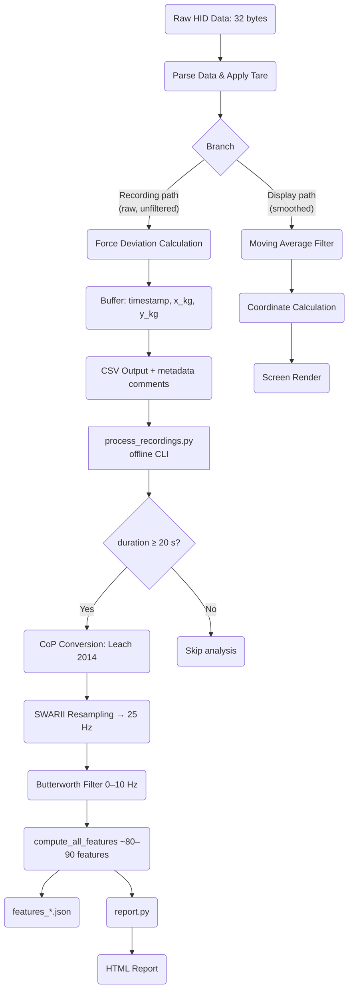

# WIIBBLE Data Processing Pipeline

This document is the canonical reference for the full data processing pipeline — from raw sensor acquisition through CSV recording, posturographic feature extraction, and HTML report generation.

For user-facing analysis commands, see [User Manual — Posturographic Analysis](../user/manual.md#posturographic-analysis--reports).
For developer setup (installing analysis extras, running scripts), see [setup.md — Posturographic Analysis and Reporting](setup.md#5-posturographic-analysis-and-reporting).

---

## Pipeline Diagram



---

## 1. Data Acquisition

- **Source:** Wii Balance Board (or `MockHIDDevice`)
- **Function:** `read_data(device)`
- **Output:** Raw byte array (list of 32 integers)

---

## 2. Parsing & Tare Correction

- **Function:** `parse_data(data, data_struct, scale_factor)`
- **Steps:**
  - Extracts sensor values for each corner from the raw byte array.
  - Applies tare (baseline) correction using values in `data_struct`.
  - Formula: `(data[i] + data[i+1] / 255 - tare) * scale_factor`
- **`scale_factor`:** Persisted in `~/.wiibble/settings.json` (default factory value in `SCALE_FACTOR_DEFAULT`). Calibrated via **Settings → Cal scale** using a known reference mass on the board.
- **Output:** `{top_left, top_right, bottom_left, bottom_right}` — corner weights in kg

---

## 3. Branching: Recording vs Display

After parsing, the pipeline splits into two independent paths.

**Raw (unfiltered) corner values** are stored in `AppState.raw_corners` and used exclusively for recording. The moving-average filter only affects the display cursor. These two paths are completely independent.

---

### 3a. Recording Path — Force Deviation (Raw)

- **Function:** `calculate_force_deviation_kg(top_left, top_right, bottom_left, bottom_right)`
- Called using `app_state.raw_corners` (never the smoothed values).
- **Formulae:**
  - `x = (top_right + bottom_right) − (top_left + bottom_left)` — left-right deviation
  - `y = (top_left + top_right) − (bottom_left + bottom_right)` — front-back deviation
- **Output:** `(x_kg, y_kg)` — raw, unfiltered force deviation

---

### 3b. Display Path — Moving Average Filter

- **Function:** `apply_filter(corners, filter_buffer, filter_window)`
- Implements a moving average over the last N frames (`ui_filter_window`).
- Has **no effect** on recorded data.
- **Output:** Smoothed corner weights in kg (display only)

---

## 4. Coordinate Calculation (display only)

- **Function:** `calculate_coordinates(...)`
- Converts **smoothed** corner weights to screen pixel coordinates.
- Normalises by total weight; scales by screen size and zoom.
- **Output:** `(x, y)` in screen pixels

---

## 5. Buffering for Recording

- **Location:** `_update_recording_frame()` in `wiibble/app.py`
- Each frame during recording, appends `(timestamp, x_kg, y_kg)` to `app_state.record_buffer` using raw corners.
- Timestamp is relative to recording start.

---

## 6. CSV Output

- **Function:** `_save_recording_csv(record_buffer, total_weight_kg, ui_filter_window)`
- Writes the buffer to `recordings/recording_YYYYMMDD_HHMMSS.csv` after recording ends.
- File structure:
  ```
  # total_weight_kg=71.2000
  # ui_filter_window=5
  time (s),x (kg),y (kg)
  0.000,0.123,-0.045
  ...
  ```
  - Comment lines provide provenance for later analysis.
  - Data rows are always raw, unfiltered values.

---

## 7. Posturographic Analysis (Offline)

Analysis runs offline via `process_recordings.py`, **not** inside the compiled app. This keeps the Nuitka build fast and free of pandas, sklearn, and statsmodels, which cannot be compiled efficiently.

- **Script:** `wiibble-process-recordings` — CLI entry point
- **Core function:** `analyse_recording(path, total_weight_kg)` in `wiibble/analysis/analysis.py`
- **Minimum duration:** 20 s (shorter recordings are skipped)

**Steps:**

1. `load_recording(path)` — reads CSV rows and parses `# key=value` metadata comments
2. `to_cop_array(data, total_weight_kg)` — converts `(x_kg, y_kg)` to Centre of Pressure in cm using **Leach et al. 2014** (Sensors 14:18244) Eq. 1:
   - `CoP_ML = 21.65 × x_kg / total_weight_kg`
   - `CoP_AP = 11.9  × y_kg / total_weight_kg`
3. `Stabilogram.from_array(cop_array)` — SWARII resampling to 25 Hz, Butterworth filter 0–10 Hz order 4
4. `compute_all_features(stabilogram, params)` — ~80–90 posturographic descriptors
5. Writes `recordings/features_YYYYMMDD_HHMMSS.json` alongside the CSV

**Output JSON keys include:** all computed features, plus provenance (`source_file`, `total_weight_kg`, `ui_filter_window`, `n_samples_raw`, `duration_s`).

---

## 8. Sampling Rate

- **Target:** 100 Hz maximum (capped in main loop)
- **Actual:** Depends on system performance
- **Post-resampling:** 25 Hz uniform grid (SWARII, applied inside `wiibble/analysis/analysis.py`)

---

## 9. Report Generation

`wiibble-report` converts a session CSV and its features JSON into a self-contained interactive HTML document.

**Inputs:**
- `recordings/recording_YYYYMMDD_HHMMSS.csv`
- `recordings/features_YYYYMMDD_HHMMSS.json`

**What is generated:**

| Section | Visualisation | Literature basis |
|---|---|---|
| Sway path | Scatter + 95% confidence ellipse | Prieto et al. 1996 |
| Time series | ML and AP displacement over time | Collins & De Luca 1993 |
| Velocity | CoP speed over time | Rocchi et al. 2002 |
| Frequency | Power spectral density (Welch) | Diener et al. 1984 |
| Diffusion | Stabilogram diffusion analysis (log-log) | Collins & De Luca 1993, 1994 |
| Spatial density | 2D histogram contour | Baratto et al. 2002 |
| Feature radar | Normalised polar chart of 6–8 key features | Visser et al. 2008 |
| Feature table | All numeric values with units | Leach et al. 2014 |

Each section has a **neutral, descriptive caption** — no clinical interpretation is included.

**CLI:**
```powershell
uv run wiibble-report recordings/recording_YYYYMMDD_HHMMSS.csv \
    --features recordings/features_YYYYMMDD_HHMMSS.json \
    --out recordings/report_YYYYMMDD_HHMMSS.html
```

Omit `--out` for the default output filename. Omit `--features` for automatic search of the corresponding JSON file. If `--features` is missing and no JSON file is found, a partial report is produced.

**Customising:** Edit `report.py` (chart logic) or `_HTML_TEMPLATE` (Jinja2 layout). See [VISUALISATION_REFERENCES.md](VISUALISATION_REFERENCES.md) for the full literature justification of each figure.

**Dependencies:** Plotly, Jinja2 — install with `uv sync --extra analysis`.

---

## Notes

- The moving-average filter is applied **only** to the display cursor. Recorded data is always raw.
- All real-time processing is done frame by frame. Analysis and reporting run offline.
- The pipeline is identical for both real and mock data sources.
