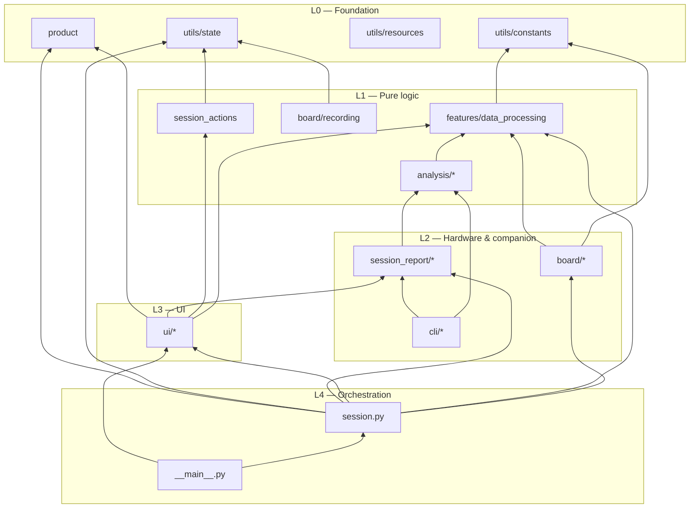
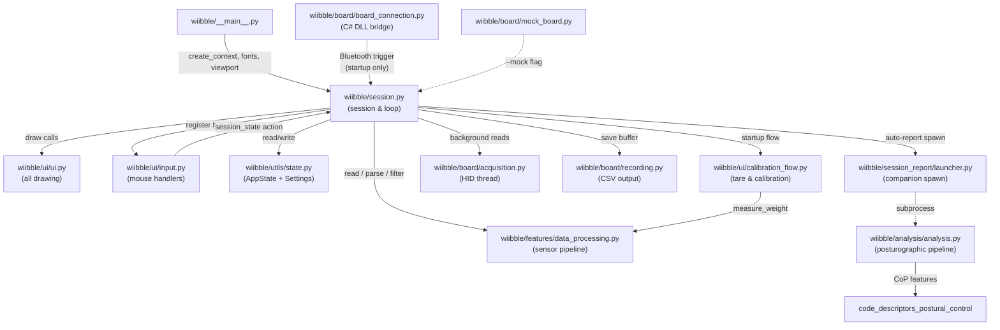
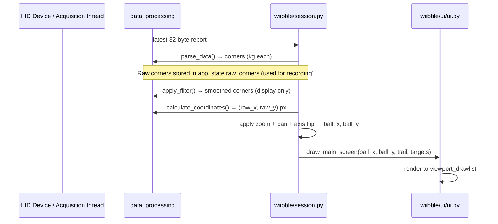
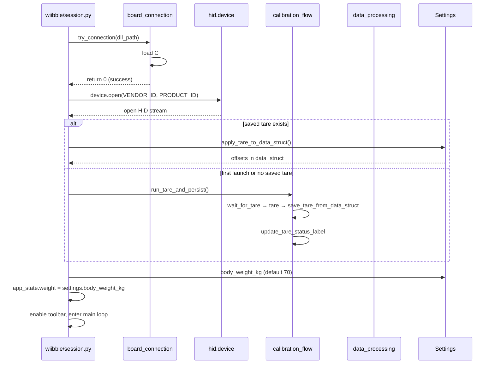
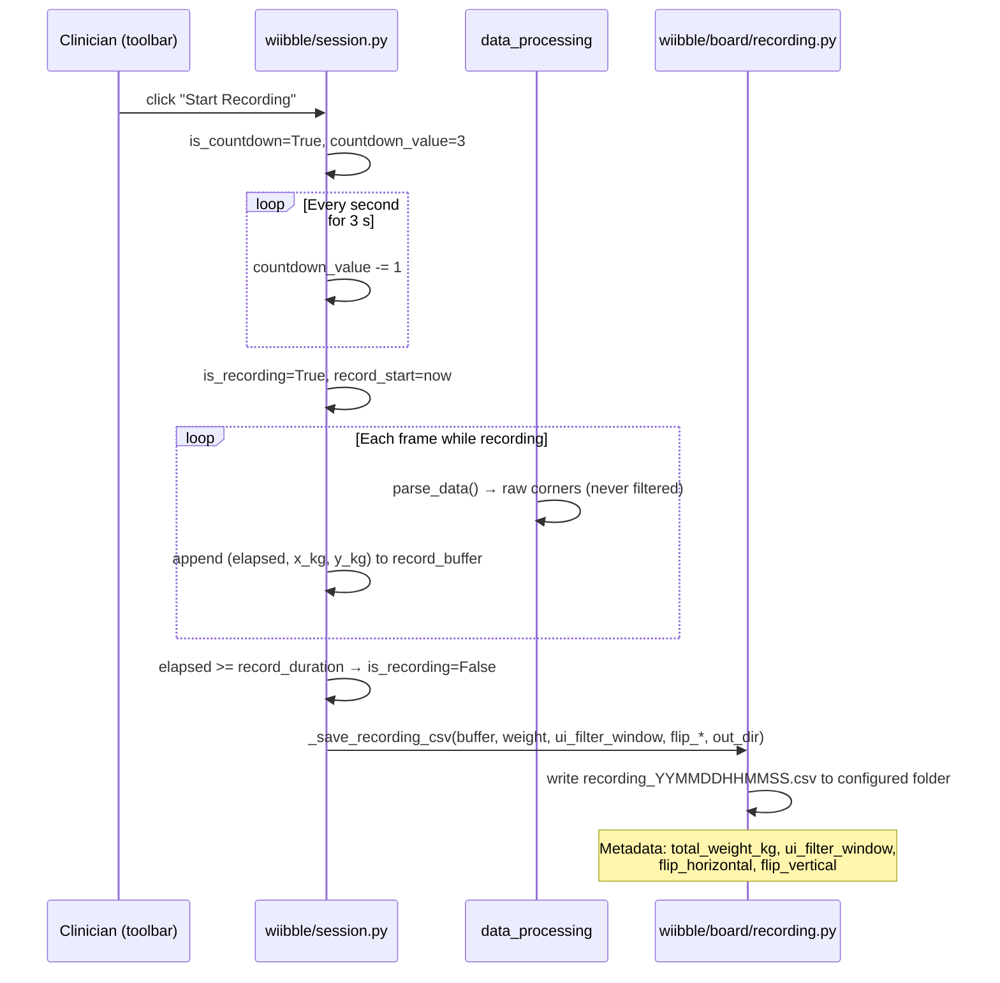
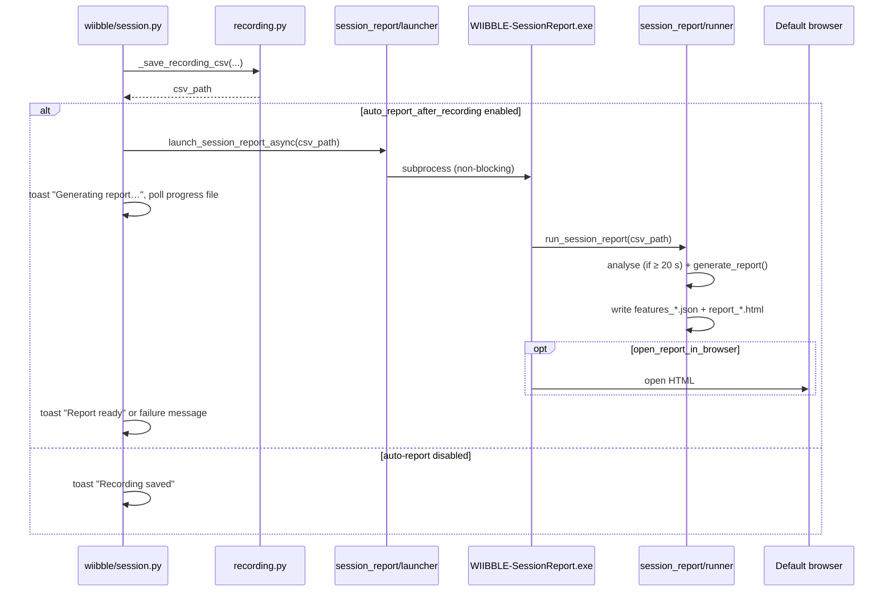
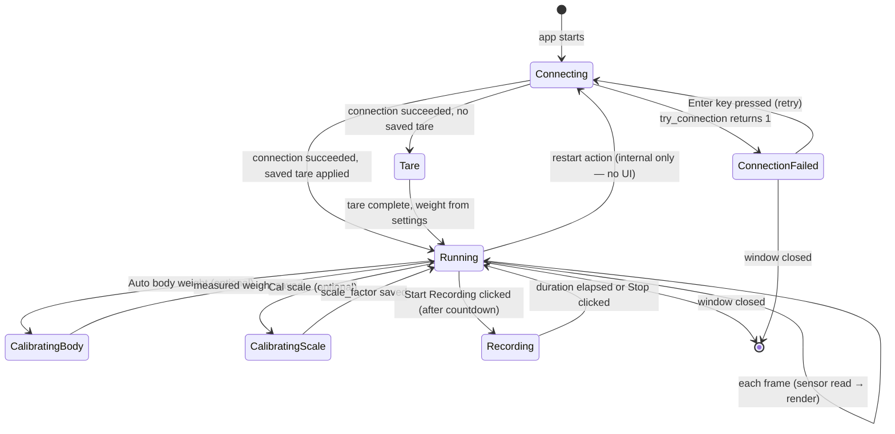

# WIIBBLE — Architecture Overview

## Documentation map

| Document | Audience | Contents |
|---|---|---|
| [architecture.md](architecture.md) | Developers | This file — layers, data flows, design decisions |
| [setup.md](setup.md) | Developers | Bootstrap, tests, build, CI |
| [DATA_PIPELINE.md](DATA_PIPELINE.md) | Developers | Sensor → CSV → features → HTML report |
| [pipeline_explainer.html](pipeline_explainer.html) | Developers | Interactive pipeline walkthrough (browser) |
| [VISUALISATION_REFERENCES.md](VISUALISATION_REFERENCES.md) | Developers / clinicians | Literature basis for report figures |
| [User Manual](../user/manual.md) | Clinicians | Interface, pairing, recording, troubleshooting |

---

## Overview

WIIBBLE repurposes a Nintendo Wii Balance Board as a clinical force platform. Physiotherapists place the board in front of a screen, have the patient stand on it, and watch a live cursor track the patient's centre of pressure in real time. The tool also lets clinicians draw rehabilitation targets (circles and rectangles) on screen, record sessions to CSV, and optionally generate interactive HTML posturographic reports at the end of each recording. It was built as part of the EPIC-Tech study at The University of Queensland / Griffith University / Princess Alexandra Hospital.

The key technical challenge is bridging a consumer gaming peripheral into a clinical workflow on a standard Windows PC. The board pairs over Bluetooth and exposes raw four-corner weight data as HID reports. WIIBBLE reads those 32-byte packets at ~100 Hz, converts them to a screen position, and renders the result using an immediate-mode GPU renderer (DearPyGui) so the display never lags behind the sensor.

An intentional design constraint is that the app must run on computers that cannot have Python installed — clinicians get a single `.exe`. All business logic is in Python; a small C# DLL (`WiiBalanceBoardLibrary`) handles the one-time Bluetooth handshake that Windows requires before HID data flows. Heavy analysis dependencies (scipy, plotly) are kept out of the main binary via a companion executable (see [ADR-003](decisions/003-session-report-companion.md)).

For developer setup, build instructions, and running the app, see [setup.md](setup.md).

---

## Folder structure

```
WIIBBLE/
├── src/wiibble/
│   ├── __main__.py              # CLI entry (`python -m wiibble`); DPG context, argparse, calls session.run()
│   ├── app.py                   # Thin re-export: `from wiibble.session import run`
│   ├── session.py               # Session hub — connection, calibration, render loop, recording, report launch
│   ├── product.py               # Compile-time FEATURE_THRIVE / FEATURE_SESSION_REPORT (full defaults)
│   ├── session_actions.py       # Settings/recording mutations triggered from UI callbacks
│   ├── features/
│   │   └── data_processing.py   # Pure sensor pipeline (parse, filter, coordinates) — no GUI imports
│   ├── board/
│   │   ├── board_connection.py  # C# DLL loader for Bluetooth handshake (startup only)
│   │   ├── acquisition.py       # Background HID read thread with latest-frame slot
│   │   ├── mock_board.py        # MockHIDDevice for --mock development
│   │   ├── recording.py         # CSV writer with provenance metadata comments
│   │   └── exceptions.py        # Board connection error types
│   ├── ui/
│   │   ├── ui.py                # Window/viewport setup; re-exports the public API of the modules below
│   │   ├── canvas_draw.py       # Canvas drawing — cursor, trail, targets, calibration screens, recording indicator
│   │   ├── settings_panel.py    # Settings-panel widgets and their callbacks
│   │   ├── cursor_geometry.py   # Pure cursor/target geometry math (no Dear PyGui imports)
│   │   ├── textures.py          # Dear PyGui texture registry (calibration and cursor images)
│   │   ├── draw_helpers.py      # Shared crisp-text draw_text helpers
│   │   ├── input.py             # Mouse/keyboard handlers; sets session_state["action"]
│   │   ├── calibration_flow.py  # Tare and on-demand calibration blocking loops
│   │   └── theme.py             # Colours, fonts, global DPG theme
│   ├── analysis/
│   │   ├── analysis.py          # Offline posturographic pipeline (CoP → features)
│   │   └── recording_meta.py    # Parse CSV metadata comment lines
│   ├── session_report/
│   │   ├── launcher.py          # Spawn companion exe or dev module (non-blocking)
│   │   ├── runner.py            # Analyse + HTML report for a single recording
│   │   └── progress.py          # Progress file polled by main app
│   ├── cli/                     # Typer CLIs: process-recordings, report, session-report
│   └── utils/                   # state, constants, resources, logging, recording_names
├── WiiBalanceBoardLibrary/      # C# project — Bluetooth handshake DLL
├── tests/                       # pytest suite (mock board, pure pipeline modules)
├── docs/
│   ├── dev/                     # Architecture, setup, pipeline, ADRs
│   └── user/                    # Clinician manual
├── compiler.bat                 # Nuitka build for WIIBBLE.exe + optional companions (WIIBBLE_PROFILE)
└── installer.iss                # Inno Setup installer
```

### Vendored research code

`src/code_descriptors_postural_control/` is **vendored third-party research code** used only by the offline analysis pipeline (`analysis/analysis.py`). It is excluded from ruff and the main app runtime. Do not import it from `session.py` or `ui/`. A future refactor may move it to `vendor/` outside the installable package.

---

## Dependency direction

Layers import only from layers below. Violations are bugs.

### Mapping to SK standards layout

WIIBBLE does not use a literal `backend/` package. The backend layer is:

| SK standard term | WIIBBLE location |
|---|---|
| `backend/` | `features/`, `board/`, `session_actions.py`, `analysis/` |
| `main/` (orchestration) | `__main__.py`, `session.py` |
| `ui/` | `ui/` |



**Rules:**

- `features/data_processing.py` must not import DPG, `session`, or `ui`.
- `ui/*` communicates session intent via `session_state["action"]` — it does not import `session.py`.
- `session.py` is the only module that wires UI callbacks, sensor reads, and recording together.
- `analysis/*` and `cli/*` run offline; they are not imported by `session.py` at runtime (companion is a subprocess).
- `session.py` and `ui/settings_panel.py` import Thrive and in-app session-report modules only when `wiibble.product` flags are True (lite profile omits those imports).
- `app.py` exists only for backward-compatible imports; new code should use `wiibble.session`.

---

## Architecture diagram



`wiibble/session.py` is the hub. It owns the session lifecycle and reaches into every other module, but it never draws — that is entirely delegated to `wiibble/ui/ui.py`. Input callbacks in `wiibble/ui/input.py` communicate back to `session.py` only through `session_state["action"]`, keeping the input layer decoupled from session logic. `wiibble/features/data_processing.py` has no DPG or state imports at all — it is a pure functional pipeline that can be tested without any hardware or GUI.

---

## Key data flows

### 1. Live sensor → cursor on screen

Every frame, raw bytes from the board are transformed into a pixel position and rendered. This is the heartbeat of the application.



### 2. Session startup (connect → tare → main canvas)

The board must be connected before data is shown. Tare offsets are persisted in settings; on later launches the saved baseline is applied without the Step OFF screen. First launch (or missing saved tare) runs the full empty-board wait and measurement flow. Body weight is loaded from persisted settings (default 70 kg). On-board weight and scale calibration are optional and triggered from the settings panel.



### 3. Recording a session to CSV

A clinician starts a recording (with optional countdown), the app buffers force-deviation values each frame, and the buffer is flushed to a CSV file when recording stops.



### 4. In-app session report (companion process)

When **generate report after recording** is enabled (default), the main app spawns a companion process after saving the CSV. This keeps scipy and plotly out of the main Nuitka binary.



Offline batch analysis (`wiibble-process-recordings`, `wiibble-report`) uses the same pipeline and remains available for older recordings or scripted workflows — see [DATA_PIPELINE.md](DATA_PIPELINE.md).

---

## Module guide

| Module | Responsibility | Notes |
|---|---|---|
| `wiibble/__main__.py` | DPG context, argparse, logging, screen-size detection | Deliberately thin — safe to import in tests; provides WIIBBLE's Python entrypoint |
| `wiibble/app.py` | Backward-compatible re-export of `session.run` | Do not add logic here; use `session.py` |
| `wiibble/session.py` | Session lifecycle, render loop, recording state machine, action dispatch, report launch | The largest orchestration file |
| `wiibble/session_actions.py` | Settings and recording mutations from UI callbacks | Keeps `ui.py` free of direct state-machine logic |
| `wiibble/ui/ui.py` | Window/viewport setup; re-exports the public API of `canvas_draw`, `settings_panel`, `textures`, `draw_helpers`, and `cursor_geometry` for backward compatibility | Never reads `AppState` for side effects during draws; receives values as arguments |
| `wiibble/ui/canvas_draw.py` | Canvas drawing — cursor, sway trail, targets, calibration/connection screens, recording indicator | Extracted from `ui.py`; imports `cursor_geometry`, `draw_helpers`, `textures` |
| `wiibble/ui/settings_panel.py` | Settings-panel widget construction and callbacks (recording, cursor, visualisation, calibration sections) | Extracted from `ui.py`; uses dynamic imports of `wiibble.ui.ui` for the handful of functions re-exported back through it, avoiding an import cycle |
| `wiibble/ui/cursor_geometry.py` | Pure cursor/target geometry math — radii, viewport bounds, edge picking, trail sizing | No Dear PyGui imports; fully unit-testable (see `tests/wiibble/ui/test_cursor_geometry.py`) |
| `wiibble/ui/textures.py` | Dear PyGui texture registry — loads and tags calibration and cursor images | `ensure_textures_loaded()` must run once before any texture-backed draw call |
| `wiibble/ui/draw_helpers.py` | Shared `draw_text` helpers for crisp font rendering, used by `canvas_draw.py` and `ui.py` | Small, dependency-free of the rest of `ui/` |
| `wiibble/ui/input.py` | Mouse click/drag/release/wheel handlers; target creation; Ctrl+pan; Ctrl+zoom | Communicates back to `session.py` only via `session_state["action"]` |
| `wiibble/features/data_processing.py` | Raw HID read, byte parsing + tare, moving-average filter, coordinate calc, weight measurement | Pure functions — no DPG imports, no state; fully unit-testable |
| `wiibble/ui/calibration_flow.py` | Unified `run_tare_and_persist`, body-weight and scale calibration blocking loops | Renders calibration screens inline; calls `dpg.render_dearpygui_frame()` directly |
| `wiibble/utils/state.py` | `AppState` (runtime mutable state) + `Settings` (persisted preferences) | Settings auto-saved via `get_settings_path()` (`%APPDATA%\WIIBBLE\settings.json` on Windows) |
| `wiibble/utils/constants.py` | Hardware IDs, byte offsets, `SCALE_FACTOR_DEFAULT`, thresholds, UI sizes | Factory default scale factor; runtime value lives in settings |
| `wiibble/ui/theme.py` | Colour palette, global DPG theme, font loading (FontAwesome + Roboto) | `load_fonts()` must be called before `dpg.setup_dearpygui()` |
| `wiibble/board/recording.py` | `_save_recording_csv()` — write buffer to timestamped CSV with provenance metadata | Extracted from session logic for testability |
| `wiibble/board/acquisition.py` | Background HID read thread with latest-frame slot | Prevents render-loop blocking; exclusive stop during calibration |
| `wiibble/analysis/analysis.py` | End-to-end posturographic pipeline: `load_recording()` → `to_cop_array()` → `Stabilogram` → `compute_all_features()` | Imports `code_descriptors_postural_control`; runs in companion or offline CLIs |
| `wiibble/session_report/runner.py` | `run_session_report()` — analyse (if ≥ 20 s) + HTML report | Used by CLI and `WIIBBLE-SessionReport.exe` companion |
| `wiibble/session_report/launcher.py` | Spawns companion exe or dev module after recording | Called from `session.py`; keeps plotly/scipy out of main exe |
| `wiibble/cli/session_report.py` | `wiibble-session-report` — single-recording analyse + report CLI | Entry point for Nuitka companion build |
| `wiibble/cli/process_recordings.py` | `wiibble-process-recordings` — batch feature extraction (`--new`, `--all`) | Scans `settings.recording_dir`; optional HTML report per file |
| `wiibble/cli/report.py` | `wiibble-report` — batch or single-file HTML reports (`--new`, `--all`) | Auto-detects features JSON; writes `report_<timestamp>.html` next to CSV |
| `wiibble/board/mock_board.py` | `MockHIDDevice` — drop-in for `hid.device()`, named scenarios | Phase model (tare → step_on_stable → normal) |
| `wiibble/board/board_connection.py` | C# DLL loader via `pythonnet`; `try_connection()` triggers the Bluetooth handshake | Called once at startup then never again — all data flows through `hidapi` |
| `wiibble/utils/resources.py` | `resource_path()` — resolves asset paths in dev and Nuitka standalone builds | Pre-resolves common paths at import time |

**Boundary worth noting:** `wiibble/board/board_connection.py` and `hid.device()` look like they do the same thing but serve entirely different purposes. The C# DLL is needed to trigger the OS-level Bluetooth handshake (a Nintendo quirk); once that succeeds and the DLL disconnects, `hidapi` opens the board as a plain HID device for all data. A developer who removes `board_connection.py` because "we're already using hidapi" will break real-hardware connects.

---

## State & lifecycle



The `restart` action in `session_state` is handled by `_handle_session_action` and causes a full reconnect cycle. No UI control exposes it (the session-restart button was removed in 2.1.0); the handler remains for programmatic use and tests.

The settings panel and quick-access controls are created at startup but hidden until tare completes and the main canvas is shown.

---

## Key design decisions

| Decision | Rationale | ADR |
|---|---|---|
| C# DLL + pythonnet for Bluetooth handshake | Windows requires a Nintendo-specific pairing handshake; logic already existed in C# (WiiBalanceWalker lineage) | [ADR-002](decisions/002-csharp-dll-bluetooth-bridge.md) |
| Companion exe for session reports | Keeps scipy/plotly out of the main Nuitka binary; main app stays responsive during ~2–4 s report generation. Omitted from lite profile builds. | [ADR-003](decisions/003-session-report-companion.md), [ADR-005](decisions/005-compile-time-product-profiles.md) |
| DearPyGui for real-time UI | Immediate-mode full-canvas redraw at ~100 Hz; `viewport_drawlist` for sensor overlay | [ADR-004](decisions/004-dearpygui-realtime-ui.md) |
| Compile-time product profiles | Same codebase can ship full (Thrive + in-app reports) or lite (neither in Settings nor companion exes) without runtime flags or a fork | [ADR-005](decisions/005-compile-time-product-profiles.md) |
| Raw corners for recording, filtered for display | Clinical traceability — CSV provenance must not depend on display smoothing | — |
| Session split (`session.py` hub, `app.py` re-export) | Testability and clearer layering; `app.py` preserved for import compatibility | — |

---

## Dependencies

| Package | Purpose | Why this one | Notes / risks |
|---|---|---|---|
| `dearpygui==2.1.1` | Immediate-mode GPU GUI | Redraws full canvas every frame, the natural model for real-time sensor data. `viewport_drawlist` gives true full-screen drawing. | **Pin strictly**, API breaks between minor versions. See [ADR-004](decisions/004-dearpygui-realtime-ui.md). |
| `hidapi==0.14.0.post2` | Read raw 32-byte HID reports from the board | Only Python library that reads raw HID without a kernel driver. Board exposes itself as a standard HID device after pairing. | |
| `pythonnet==3.0.3` | Load the C# DLL at runtime via `clr.AddReference()` | The Bluetooth handshake logic already existed in C#; `pythonnet` bridges it without a rewrite. | Must be 3.x — 2.x API is incompatible. See [ADR-002](decisions/002-csharp-dll-bluetooth-bridge.md). |
| `numpy>=1.26,<3` | Array averaging in `tare()` | Used in one place in the main app. | |
| `pytz` | Timezone-aware timestamps in filenames | Standard choice. | |
| `typer>=0.26` | CLI entry points | Cross-platform `--help`; replaces argparse for offline tools. | |
| `scipy`, `plotly`, `jinja2` *(analysis extra)* | Posturographic analysis and HTML reports | Only in companion exe and offline CLIs — not in main app | |
| `nuitka>=2.0` *(dev)* | Compile to standalone `.exe` | Produces a true compiled binary — fewer AV false-positives, faster startup, no Python runtime required on clinical machines. | |
| `pytest` / `pytest-cov` *(dev)* | Test runner + coverage | Standard. | Coverage gate ≥ 80% enforced in CI. |
| `ruff>=0.4` *(dev)* | Lint and format | Fast; configured in `pyproject.toml`. | Runs in CI. |

---

## Where to start reading

1. **`wiibble/utils/state.py`** — understand `AppState` and `Settings` first; almost every module touches them.
2. **`wiibble/features/data_processing.py`** — the pure sensor pipeline; read alongside `wiibble/utils/constants.py`.
3. **`wiibble/session.py` / `_run_session()`** — the main session flow from connection to render loop.
4. **`wiibble/ui/ui.py` / `draw_main_screen()`** — how the canvas is rendered each frame.
5. **[DATA_PIPELINE.md](DATA_PIPELINE.md)** — end-to-end path from HID bytes to HTML report.
